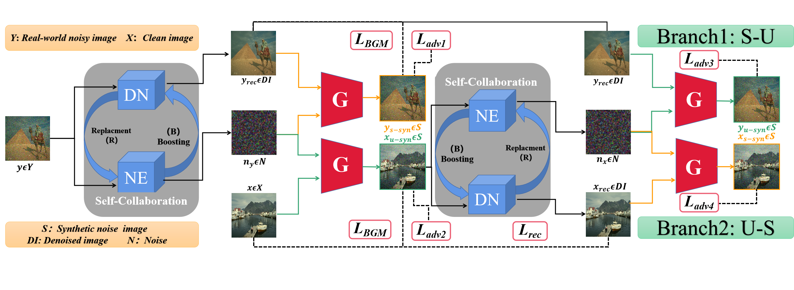

# 【ICCV 2023】 Unsupervised Image Denoising in Real-World Scenarios via Self-Collaboration Parallel Generative Adversarial Branches

### Xin Lin, Chao Ren, Xiao Liu, Jie Huang, Yinjie Lei

)

This is the official code of SCPGabNet

## Abstract
Deep learning methods have shown remarkable performance in image denoising, particularly when trained on large-scale paired datasets. However, acquiring such paired datasets for real-world scenarios poses a significant challenge. Although unsupervised approaches based on generative adversarial networks (GANs) offer a promising solution for denoising without paired datasets, they are difficult in surpassing the performance limitations of conventional GAN based unsupervised frameworks without significantly modifying existing structures or increasing the computational complexity of denoisers. To address this problem, we propose a self-collaboration (SC) strategy for multiple denoisers. This strategy can achieve significant performance improvement without increasing the inference complexity of the GAN-based denoising framework. Its basic idea is to iteratively replace the previous less powerful denoiser in the filter-guided noise extraction module with the current powerful denoiser. This process generates better synthetic clean-noisy image pairs, leading to a more powerful denoiser for the next iteration. In addition, we propose a baseline method that includes parallel generative adversarial branches with complementary “self-synthesis” and “unpaired-synthesis” constraints. This baseline ensures the stability and effectiveness of the training network. The experimental results demonstrate the superiority of our method over state-of-the-art unsupervised methods.

## Requirements
Our experiments are done with:

- Python 3.7.13
- PyTorch 1.13.0
- numpy 1.21.5
- opencv 4.6.0
- scikit-image 0.19.3

## Dateset

SIDD
Train: https://pan.baidu.com/s/1c1iPIIJvSfq6s6_M7iyjPA  2oe5 

Test: https://pan.baidu.com/s/1yltsD684qpJa0SMJ9SdR5w   8qzf 

## Pre-trained Models

https://pan.baidu.com/s/1EdXN7o9EW_ssDRHxDKFeXw    icp1 

## Train & Test
You can get the complete SIDD validation dataset from https://www.eecs.yorku.ca/~kamel/sidd/benchmark.php.

'.mat' files need to be converted to images ('.png'). 

train and test are both in `train_v6.py`.

run `trainv6.py`.

## Citation

    @inproceedings{scpgabnet,
      title={Unsupervised Image Denoising in Real-World Scenarios via Self-Collaboration Parallel Generative Adversarial Branches}, 
      author={Xin Lin and Chao Ren and Xiao Liu and Jie Huang and Yinjie Lei},
      booktitle={Proceedings of the IEEE/CVF International Conference on Computer Vision},
      year={2023}
    }

## Contact
If you have any questions, please contact linxin@stu.scu.edu.cn
